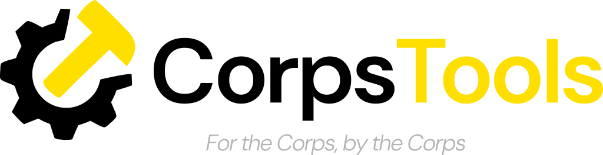

# CorpsTools



**For the Corps, by the Corps.**

CorpsTools is a centralized hub for innovative, cadet-driven technological solutions designed to empower the Corps of Cadets. It hosts a collection of various websites, applications, and tools created by cadets to solve everyday problems and enhance efficiency within the Corps.

## 🛠 Tech Stack

- **Frontend:** HTML5, CSS3 (Bootstrap 5), JavaScript (ES6+)
- **Build Tool:** [Vite](https://vitejs.dev/)
- **Backend:** [Node.js](https://nodejs.org/) with [Express](https://expressjs.com/)
- **Authentication:** Microsoft OAuth2 (West Point SSO integration)
- **Feedback Integration:** [Canny SSO](https://canny.io/)

## 🏁 Getting Started

### Prerequisites

- Node.js (>= 20.x)
- Yarn or npm

### Installation

1. Clone the repository:
   ```bash
   git clone https://github.com/your-repo/corps_tools_page.git
   cd corps_tools_page
   ```

2. Install dependencies:
   ```bash
   yarn install
   # or
   npm install
   ```

3. Set up environment variables:
   Create a `.env` file based on `.env.example` and fill in the required credentials:
   ```env
   SESSION_SECRET=your_session_secret
   MICROSOFT_CLIENT_ID=your_ms_client_id
   MICROSOFT_CLIENT_SECRET=your_ms_client_secret
   CANNY_PRIVATE_KEY=your_canny_key
   API_URL=http://localhost:3000
   ```

### Development

Run the Vite development server for frontend changes:
```bash
yarn dev
# or
npm run dev
```

### Production

1. Build the frontend assets:
   ```bash
   yarn build
   # or
   npm run build
   ```

2. Start the Node.js server:
   ```bash
   yarn start
   # or
   npm start
   ```

The application will be available at `http://localhost:3000`.

## 📂 Project Structure

- `index.js`: Express server handling authentication and static file serving.
- `vite.config.js`: Configuration for building the multi-page application.
- `package.json`: Project dependencies and scripts.
- `src/`: Frontend source directory.
  - `index.html`: Main landing page.
  - `about.html`: About page.
  - `style.css`: Global styles.
  - `about.css`: Styles specific to the about page.
  - `public/`: Static assets like logos and icons.
- `dist/`: Generated production build (after running `build`).

## 🤝 Contributing

We welcome contributions from the Corps! If you have a tool you'd like to list or want to improve the site:

1. Fork the repository.
2. Create a new feature branch.
3. Submit a Pull Request.

---
*Created and maintained by the Corps of Cadets.*
